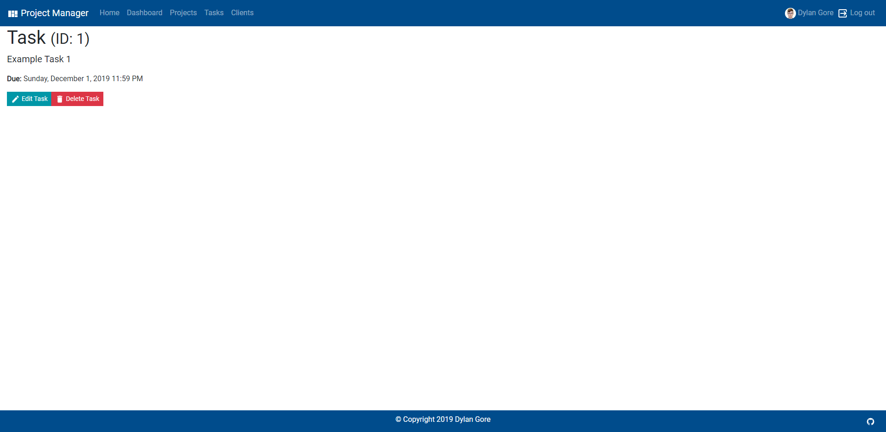

# B.Sc (Hons.) Level 8 - Assignment 1 - Single Page Application

**Name:** Dylan Gore

**Public Demo URL:** [https://dylangore-wit-webappdev2.web.app/](https://dylangore-wit-webappdev2.web.app/)

## Overview

This is a simple project management app. It has authentication and registion along with the ability to add, view, edit and remove projects. It also features client and task management.

### Features

-   User authentication (Login, Registration, Password Reset)
-   Custom componets created to handle route guarding (ensuring private routes can only be accessed by logged in users)
-   Full CRUD functionallity for projects, clients and tasks
-   The user's avatar is downloaded from Gravatar if it exists, if not a default image is displayed
-   Front end deployed to Firebase Hosting
-   Connection to a json-server backend (hosted on my own sever)
-   Responsive design

## Setup

1. Create the .env file
   To run the app locally you must create and populate .env file, a sample is provided (sample.env)
   For a local run the backend will be located at http://localhost:3002/ - this must be put in the .env file

    (If you're deploying the app, don't forget to create a deploy.env file!)

2. Install required dependanceis using NPM

    ```bash
    npm install
    ```

3. Run the json-server backend

    ```bash
    npm run fake-backend
    ```

    The will be available at [http://localhost:3002](http://localhost:3002)

4. Run the React App

    ```bash
    npm run start
    ```

    The will be available at [http://localhost:3001](http://localhost:3001)

5. Run the Storybook Server (Optional)

    ```bash
    npm run storybook
    ```

    The will be available at [http://localhost:3001](http://localhost:3001)

## Data Model Design


-   Tasks are linked to a project using a project id
-   Clients are linked to a project using a project id

## UI Design

### Home


The app home page.

### 404


The 'Not Found' error page - is displayed if the URL doen't match something in the router.

### 401


The 'Unauthorized' error page

### Login


Allows the user to login to an existing account

### Register


Allows the user to create a new account.

### Reset Password


Allows the user to have a password reset email sent for a forgotten password.

### Dashboard


Shows a short list of projects and tasks, allows the user to view each in more detail or add a new project/task.

### Projects


Shows a full list of projects.

### Project


Shows a single project with full details.

### Add/Edit Project


Allows the user to add a new poroject, the same form is uesd for editing an existing project, in that case the fields a pre-populated with the existing values and the submit button and page title are changed.

### Tasks


Shows a full list of projects.

### Task


Shows a single task with full details.

### Add/Edit Task


Allows the user to add a new task, the same form is uesd for editing an existing task, in that case the fields a pre-populated with the existing values and the submit button and page title are changed.

### Clients


Shows a full list of clients.

### Client


Shows a single client with full details.

### Add/Edit Client


Allows the user to add a new client, the same form is uesd for editing an existing client, in that case the fields a pre-populated with the existing values and the submit button and page title are changed.

### Delete


Prompts the user for confirmation before deleting an item.

## Routing

### General

-   / (public) - home page
-   /dashboard (auth required) - displays a short list of projects and tasks
-   /404 (public) - not found error page (this is default for any unrecognised URL)

### Projects

-   /projects (auth required) - lists all projects and options to add a project/view in more detail
-   /projects/add (auth required) - form to add a new project
-   /projects/:id (auth required) - project info in full detail, option to edit/delete, lists tasks associated with that project
-   /projects/edit/:id (auth required) - form to edit an existing project

### Clients

-   /clients (auth required) - lists all clients and options to add a client/view in more detail
-   /clients/:id (auth required) - form to add a new client
-   /clients/edit/:id (auth required) - client info in full detail, option to edit/delete
-   /clients/add (auth required) - form to edit an existing client

### Tasks

-   /tasks (auth required) - lists all tasks and options to add a task/view in more detail
-   /tasks/add (auth required) - form to add a new task
-   /tasks/:id (auth required) - task info in full detail, option to edit/delete
-   /tasks/edit/:id (auth required) - form to edit an existing task

### Authentication

-   /login (logged out users only, cannot access if logged in) - user login form, links to registration and password reset
-   /register (logged out users only, cannot access if logged in) - user registration form
-   /reset-password (public) - password reset form

## Storybook

### List of stories


### Storybook Addons

-   **[knobs](https://www.npmjs.com/package/@storybook/addon-knobs)** - allows the user to modify props to pass to the component in real time (see below)
    
-   **[actions](https://www.npmjs.com/package/@storybook/addon-actions)** - shows a console message when certain actions are preformed (eg. clicking on a link)
    
-   **[viewport](https://www.npmjs.com/package/@storybook/addon-viewport)** - allows testing of component responsiveness by emulating different devies
    

## Backend (Optional)

This app uses [json-server](https://github.com/typicode/json-server) as a backend. The app is setup to read the location of the backend from a .env file. This allows the backend to be deployed to a remote server and it's location to be passed into the app.

## Authentication (Optional)

Google's [Firebase](https://firebase.google.com) is used for authentication. User registration, login and password reset are all handled through the app. The package [react-firebase-hooks](https://github.com/csfrequency/react-firebase-hooks) is used to make Firebase integration work correctly and allows the user state (currently logged in user) to be accessed throughout the app.

## Independent learning

-   React hooks, useEffect and useState, functional components
-   Connecting to the Gravatar API for user avatars
-   Deploying to Firebase and deploying the json-server to my own server
-   react-helmet for modifing the page title dynamically
-   Moment for date formatting
-   Using env-cmd to pass different .env files for different situations
